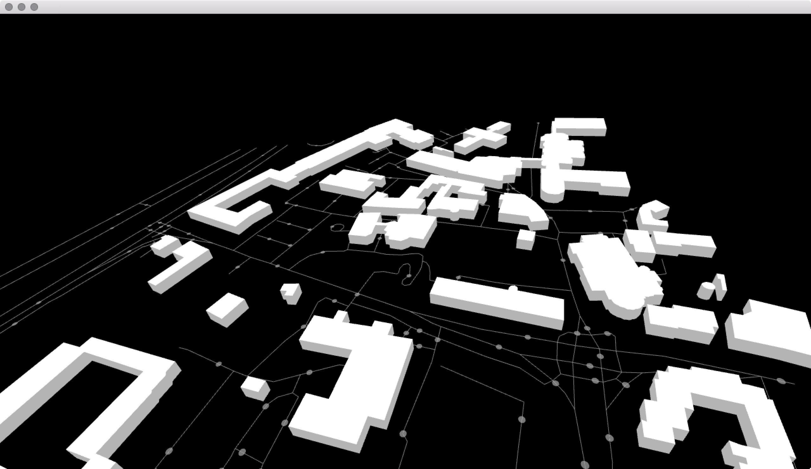

# Binary Patina II basic

OSX 10.11, Xcode 7, oF 0.9

Default JSON to MAP View

original Source : [https://github.com/tangrams/ofVectorTile](https://github.com/tangrams/ofVectorTile)
oF 0.9 version : [https://github.com/jeonghopark/ofVectorTile](https://github.com/tangrams/ofVectorTile)

### TODO
- Lighting setting
- GeoJSON Code edit

Coordinat : [http://www.maptiler.org/google-maps-coordinates-tile-bounds-projection/](http://www.maptiler.org/google-maps-coordinates-tile-bounds-projection/)
JSON : [http://vector.mapzen.com/osm/all/{zoom}/{x}/{y}.json](http://vector.mapzen.com/osm/all/{zoom}/{x}/{y}.json)

### FPC Control
View Direction : Mouse or Trackpad
Moving : w, s, a, d
Up/Down : e, c
Roll : q, r

ofxFirstPersonCamera
ofxImmediateModeInput
ofxJSON
ofxCsv
ofxGui
ofxUnicode
ofxFontStash

